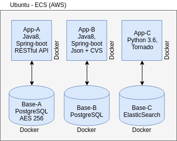

# Solução proposta
------------------------
* Solução baseada em containers docker, orquestrados com docker-compose. Tanto aplicações quanto bases de dados são containerizadas.
* Deploy de toda solução em uma instância EC2 da AWS (18.228.30.214). A máquina foi provisionada com ansible e o deploy foi realizado com shell-script. Todo o código, tanto de provisionamento quanto para deploy se encontra nesse repositório.
* Para as bases de dados (PostgreSQL e Elasticsearch), seria ideal que se utilizassem os serviços da AWS (RDS e Amazon Elasticsearch Service, respectivamente), mas para simplificação, devido ao fato de que o tempo para realização da prova é curto, provisionei todos componentes na mesma máquina.
    

